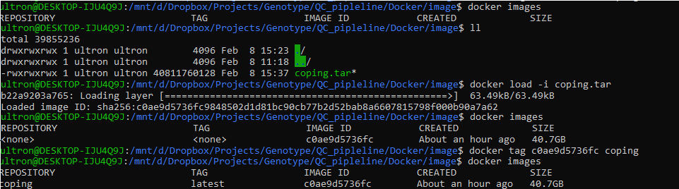

```{r setup, include=FALSE}
knitr::opts_chunk$set(echo = TRUE)
```

# INTRODUCTION

COPING is a **C**ontainerised w**O**rkflow for **P**rocessing **I**llumi**N**a **G**enotyping data. The container is deployable on multiple platforms and allows users to quickly and effortlessly prepare, pre-process and understand Illumina microarray SNP data for data analysis through an informative and interactive summary report. 

# DOWNLOAD EXAMPLE DATA

The following download links provides the files required for the following tutorial. You can also use your own data, in which case follow the instructions in [GENERATE USER SPECIFIC DATA]

1. [COPING docker image]()
2. [example genomeStudio report_file]()
3. [example gender file]()
4. [example Illumina manifest file]()
5. [coping execution file]()

**If there any issues with the following links then please email me at hamel.patel@kcl.ac.uk**

# GENERATE USER SPECIFIC DATA

COPING requires 3 files that the user must generate if they wish to run COPING on their data. 

## GenomeStudio report file

The GenomeStudio report file is generated in GenomeStudio after QC. This can be generated by the following steps:

1. Remove all filters to display all remaining SNPs and Samples
2. Select Full Data Table
3. Select Column Chooser
4. From the Displayed Columns window select:
    + Index
    + Address
    + Gen Train Score
    + Frac A
    + Frac C
    + Frac G
    + Frac T
5. Click Hide
6. From the Displayed Subcolumns Window select:
    + Score
    + Theta
    + R
7. Click Hide
8. From the Hidden Subcolumns Window select:
    + X
    + Y
9. Click Show
10. Ensure the columns are in the order shown below:

 

11. Select all SNPs
12. Select Export displayed data to file.
13. Browse to the “07.GenomeStudio_final_reports” folder and save as [PROJECT_NAME]_[DATE]_intensity_data.report in tab delimited format

##  Gender file

The gender file simply specifies the gender for each sample in tab delimited format. M/Male must be used for male samples and F/Female must be used for female samples. Unknowns can be left blank or kept as Unknown. e.g

sample1     Male
sample2     Female
sample3     Male
sample4     Unknown
sample5     Male

## Illumina manifest file
 
The Illumina manifest file (*.csv) contains details about the SNPs used for genotyping. This file is used to update the allele coding to Illumina TOP. Ensure the manifest and project are in the GRCh37 (hg19) genome build, as the ancestry data is calculated based on these positions. The Illumina manifest name should end in "A1", if it ends in "A2" this is most likely the 38 build.

# INSTALLATION

The following tutorial is an example of installing COPING on a windows or linux machine using the ubuntu terminal. For windows machines, WSL needs to installed, followed by Ubuntu.

## Install Docker

Docker can be installed onto the users operating system following [docker](https://docs.docker.com/get-docker/) guide.

## Import Docker image

1. If not already done, download the [COPING docker image](). navigate to the folder where the docker image is stored and import the COPING.tar image into the docker repository:

```{r, engine = 'bash', eval = FALSE}
docker load -i coping.tar

```

2. confirm the docker image has loaded using:

```{r, engine = 'bash', eval = FALSE}

docker images

```

3. Give the newly imported image a name, replacing the docker IMAGE ID (c0ae9d5736fc) with what you have listed. Ensure the new name provided is "coping", as the execution script will be looking for this image.


```{r, engine = 'bash', eval = FALSE}

docker tag c0ae9d5736fc coping

```

4. confirm the docker image has been successfully renamed:

```{r, engine = 'bash', eval = FALSE}

docker images

```

A working example is provided below:



# RUN COPING PIPELINE

1. Place the GenomeStudio report file, gender file, Illumina manifest file and COPING execution script into the same directory. For this tutorial, an "example" folder is created and all files are moved there.

2. Edit the "execution file" and specify:
    + **data_location:** This is the location of where the data is stored and where the output will be generated. For our example this will be the folder created in step 
    3 above ("example"). Ensure you specifiy the full path of the folder.
    + **manifest_file:** This is the name of the manifest file. For our example this will be "HumanCoreExome-24v1-0_A.csv". 
    + **clinical_gender:** This will be the name of the clinical gender file. For our example this will be "example_phenotype_gender.txt"
    + **report_file:** This will be the name of the GenomeStudio report file. For our example this will be "example.report"
    + **sample_call_rate:** Samples with a call rate below 95% are removed prior to processing the data through the rare variant calling algorithm; zCall (as recommended by the zCall protocol). To calculate potential problematic samples post zCall, such as sex discrepancies, het outliers, IBD, ancestry, etc.., an additional "sample_call_rate" threshold is applied. samples below this threshold are only temporarily removed to identify problematics samples, they are re-introduced into the data at the end of the pipeline for the user. The recommended (default) value is set at 0.98. only change from default if the data has a large number of samples with a low call rate below 0.98. Users can use 0.95, 0.96, 0.97 or 0.98
    
The following is an explanation of the docker settings. These do not require changing and simply inform the user of how docker is run.

```{r, engine = 'bash', eval = FALSE}

# run docker in detached mode
docker run -d \

      # provide a name for the conatiner
      --name "COPING" \
        
      # mount data location from the users machine to the docker internal image
      -v ${data_location}:/Genotype_QC_pipeline/4.data \
                
      # mount output location from the docker image
      -v ${data_location}/pipeline_output:/Genotype_QC_pipeline/5.pipeline_output \
                        
      # at the start of docker, execute this script. 
      --entrypoint=/Genotype_QC_pipeline/3.master_script/run_zCall_QC_pipeline.sh \
                                
      # name of docker image to run. This may require changing if the user labels the image differently to coping:latest
      coping:latest \
                                        
      # inputs required for the "Genotype_QC_pipeline/3.master_script/run_zCall_QC_pipeline.sh" script within docker
      /Genotype_QC_pipeline/4.data/${manifest_file} \
      /Genotype_QC_pipeline/4.data/${clinical_gender} \
      /Genotype_QC_pipeline/4.data/${report_file} \
      ${sample_call_rate}

```

3. Save changes to the script and run the execution script:

```{r, engine = 'bash', eval = FALSE}
./COPING_execution.sh

```

4. Error checking. Check the "QC_logfile.txt" file for any errors after the pipeline has finished.

```{r, engine = 'bash', eval = FALSE}
grep "error" QC_logfile.txt

```

The example data takes 54 minutes to run on a machine with 6 dual cores and 32GB ram.

# COPING OUTPUT 

An explantion of the output files will be explained in the summary report. The data will be arranged in the following folders:

+ **0.Scripts_and_logfiles**: Contains the master script and associated logfiles
+ **1.GenomeStudio_report_file**: Contains the processed GenomeStudio output file that was used as input for the Genotyping QC Pipeline
+ **2.Illumina_manifest_and_allele_update_file**: Contains the Illumina manifest and the allele update files in the Illumina TOP strand format
+ **3.Clinical_gender**: Contains the clinical gender information
+ **4.Prepare_report_file**: Contains report file with problematic samples removed
+ **5.Duplicate_samples**: Contains information duplicate IDs identified and any associated changes
+ **6.Samples_SNPs_removed**: Contains list of samples and SNPs removed before applying zCall
+ **7.zCall**: Contains zCall related files
+ **<span style="color: red;">8.FINAL_QC_DATA</span>**: Contains final processed data after zCall. The data is provided in the Illumina TOP strand. If duplicates existed in this data, then the ".fam_with_dup_ID" contains sample IDs that were changed. This data should be used for further analysis
+ **9.Additional_QC**: Contains additional processing that was performed on the final processed data to identify additional potential problematic issues
    + 1.Low_call_rate_SNP_samples_removed: Contains the PLINK binary file when SNPs with a call rate below 95% and samples with call rate below below user defined are removed. The "08.zcall_final_low_snp_sample_removed.mindrem.id" file lists the samples removed
    + 2.Pruned_data: Contains the pruned data
    + 3.Sex_check: Contains gender check information and plots. The "08.gender_missmatches.txt" file lists all samples with gender mismatches
    + 4.Heterozygosity_test: Contains heterozygosity test related files and plots. The "08.zcall_final_highLD_and_nonautosomal_removed.het.LD_het_outliers_sample_exclude.txt" file lists all samples identified as outliers
    + 5.Idenity-by-Descent: Contains IBD related files and plots. The "08.IBD_outliers.txt" file contains samples identified as related
    + 6.Ancestry_estimation: Contains files and plots relating to ancestry check
    + 7.Call_rate_plots: Contains sample call rate plots after QC
    + 8.MAF_plot_and_snp_summary: Contains MAF plots and summary on number of SNPs
    + 9.Compiled_list_of_potential_problematic_samples: Contains list of samples that have been identified as outliers.
+ **summary_report.html**: This is an interactive summary report which provides more information on the data.


