---
title: "GenomeStudio Genotyping QC SOP v.1.6"
author: "Dr Hamel Patel and Mr Lee Hyuck Sang hamel.patel@kcl.ac.uk sang_hyuck.lee@kcl.ac.uk"
output: rmdformats::readthedown
---

```{r setup, include=FALSE}
knitr::opts_chunk$set(echo = TRUE)
```

# INTRODUCTION

Genotyping microarrays remain a popular tool to explore genetic variants such as single nucleotide polymorphism (SNP) and large structural changes in DNA. The Illumina genotyping arrays accomplish this by using pre-defined oligonucleotide probes designed to hybridise specific regions of genomic DNA, followed by extension using chemically labelled nucleotides. The probe extension binds either red or green fluorescent agents, which can be interpreted by the Illumina specific software GenomeStudio. This software determines the identity of alleles by automated clustering of samples based on the similarity of fluorescent intensity. However, the default clustering algorithm can fail to identity valid clusters and can also assign the wrong genotype to samples due to abnormal intensity patterns. This can be addressed by manually reviewing and recalling of SNPs to increase the reliability, confidence and overall quality of the data, making this an extremely crucial quality control (QC) procedure prior to further QC using PLINK or genetic interpretation. Through processing thousands of human patient samples from various tissue sources and on a variety of Illumina genotyping chips, we have accumulated extensive hands-on experience of transforming raw Illumina genotype intensity data to high-quality analysis-ready data. This includes processing both mainstream and custom content genotyping chips with over 4 million markers per sample. We have developed custom clustering files for each genotyping chip to address common problematic variants, allowing for quick and accurate assignment of genotypes to samples. This reduces the quantity of manual intervention required during the QC process, which effectively reduces the amount of human-introduced biases across batches. The following protocol is a description of the QC steps required to thoroughly process raw Illumina microarray-based genotyping data using the Illumina specific [GenomeStudio](https://emea.illumina.com/techniques/microarrays/array-data-analysis-experimental-design/genomestudio.html) software. Following this protocol will convert raw image data to a reliably detected genotype calls (.report) file which can be further processed using our Containerised wOrkflow for Processing IllumiNa Genotyping microarray data [(COPING)](https://github.com/hamelpatel/COPING), to recall and improve the reliability and accuracy of rare variants that may have been missed by GenomeStudio, further improving the quality of the data. For any queries, collaboration request or fee-for-service, please contact the authors.

**Note**

+ The GenomeStudio software requires a minimum of 100 samples to cluster the data accurately. However, to thoroughly process the sex chromosomes its recommended to have at least 100 male and 100 female samples. Projects with less than a 100 samples are recommended to use pre-defined cluster files to cluster the data.
+ This protocol provides procedures to identify problematic SNPs which will require the user to manually review. Users should NOT apply the specified thresholds in this protocol and blindly remove SNPs. 
+ The time required to QC data primarily depends on the combination of quality of the data, number of samples, number of SNPs, tissue source and compute power.
+ It is recommended to QC samples originating from the same tissue sources in a single batch, as DNA quality is known to vary across different tissues (i.e blood, buccal, saliva, etc..). Processing samples originating from different tissue sources can cause issues in clustering, resulting in unreliable genotype calls.
+ To manually re-cluster a SNP, hold the "SHIFT" button and position the mouse to the centre of a cluster, the mouse cursor will turn to a "+" symbol. While still holding down the SHIFT key, click and hold the left mouse button and move the cluster to the desired location on the SNP Graph. This process can be repeated multiple times for the same SNP until the user is satisfied with the clustering of the SNP.
+ If the user is unsure which cluster samples may belong too, users are advised to leave these samples as uncalled. The downstream QC with the zCall pipeline will attempt to assign these uncalled samples to a cluster using the zCall clustering algorithm. 
+ When re-clustering, if in doubt, zero the SNP
+ Any SNPs "zeroed" will be deemed as uninformative and will be dropped during the zCall QC pipeline.
+ Users are advised to read the [GenomeStudio User Guide](https://support.illumina.com/content/dam/illumina-support/documents/documentation/software_documentation/genomestudio/genomestudio-2-0/genomestudio-genotyping-module-v2-user-guide-11319113-01.pdf) and the [Illumnia technical notes to analyse genotype data](https://dnatech.genomecenter.ucdavis.edu/wp-content/uploads/2013/05/technote_infinium_genotyping_data_analysis.pdf) in GenomeStudio prior to this protocol to understand technical terminology and how to use GenomeStudio.
+ GenomeStudio is known to be temperamental and can occasionally crash, losing any unsaved work. It is highly advised to continuously save the project when possible. 

# RECOMMENDED REPOSITORY FORMAT

The following is an optional data directory format which is useful in organising all the files associated with Genotyping data.

1. Create the folder directories using the script “create_genotyping_folder_structure.sh" (**Need to add download link**). This will create the following:
    + 01.Project_information
    + 02.DATA
    + 03.dMAPS
    + 04.Sample_information
    + 05.GenomeStudio_manifest_and_egt
    + 06.GenomeStudio_project
    + 07.GenomeStudio_final_reports
    + 08.COPING_pipeline_output
    + 09.CNV
    + 10.Notes
    + README.txt


# REQUIRED DATA

1. idat files
2. Illumina manifest
3. sample sheet

The Sample Sheet contains information on samples to be imported into GenomeStudio, and is generally provided with the data by the genotyping centre. The Sample Sheet is in a .csv format, should be opened in excel and requires the following columns to be completed. 

1. Sample ID 
2. SentrixBarcode (chip barcode of where sample has been genotyped)
3. SentrixPosition (position on the chip of where the sample has been genotyped)
4. Sample_Plate (Plate ID)
5. Sample_Well (Well position of sample)
6. Sample_Group (optional: Tissue source, i.e saliva, buccal, blood, etc...)
7. Gender (optional: F, M, Female or Male, with the first letter always in uppercase. Any other nomenclature will be imported as “Unknown”. Without gender information the sex chromosomes cannot be reliably processed)
8. Sample_Name (optional: alias name)
9. Replicate (optional: replicate)
10. Parent 1 (optional: Father ID)
11. Parent 2 (optional: Mother ID)
12. Path (Full path to data directory containing the IDAT file for the sample in question)

The Sample Sheet should be saved in .csv format.

# INITAL GENOMESTUDIO SETTINGS

GenomeStudio uses the GenCall algorithm to cluster the raw intensity data and assign genotype calls. The software has default parameters and setting which can be tuned to speed up the QC process. The following applies to GenomeStudio 2.0.4.

1. Select Tools > Options > Project:
    + check “Exclude Female Y-SNPs from SNP Statistics” box
    + ensure the “No-call Threshold” is set to 0.15 
    + click “Use for all New Projects” 
2.  Select Tools > Options > Module > Genotyping:
    + check the "Use memory-based storage" box. This will massively speed up the clustering process. Sufficient memory is required for this option. We have successfully used this option with a 32GB RAM machine, clustering 1000’s sample.

**Note**: GenomeStudio will often reset this to default, users should check these settings every time a project is created/opened.

# CREATE A NEW GENOTYPING PROJECT

1. Select file > New Project > Genotype and follow the GenomeStudio Project Wizard.
2. Under “Projects Repository”:
    + Navigate to the "06.GenomeStudio_project" folder.
3. Under “Project Name”:
    + Create project as: [PROJECT_NAME]_[DATE]_01.bsc and click “Next”.
4. Select “use sample sheet to load sample intensities” and click “Next”.
5. Specify sample sheet, idat files location, and manifest location, and click “Next”.
6. Here we have an option to “import cluster positions from a cluster file” to cluster the data. From experience, we have discovered that using the default Illumina cluster file or a cluster file generated from a different lab from which the data was generated, can lead to poor clustering. This is generally due to laboratory specific variation, which leads to intensity data variation which leads to cluster drifts. We recommend not using a cluster file, but to cluster the data using the data itself. **NOTE** the clustering algorithm requires a minimum of 100 samples to work effectively. Once a Genotype project has been QC'd, the cluster positions can be exported and re-used to cluster new data genotyped on the same genotype chip. To use an existing cluster file, check the “Import cluster positions form a cluster file” box and specify the cluster file (.egt) location. Otherwise, check “Cluster SNP’s”.
7. Check “Calculate Sample and SNP Statistics” and “Pre-calculate”. 
8. Ensure Gen Call Threshold is set at 0.15 and click “Finish” to create the project. Depending on compute power, number of samples/SNPs this may take several minutes to several hours to cluster the data and calculate statistics.
9. Once the project has been created, **CHECK SAMPLE NUMBERS IN GENOMESTUDIO MATCH THAT IN SAMPLE SHEET !!!!** If there are any errors in the sample sheet or a sample is not present at the given location, GenomeStudio will not upload the sample in question, and will NOT prompt an error.

# QC

## How to manually edit clusters and SNPs

Throughout this protocol, SNPs will need to be manually edited to correctly cluster samples. To manually edit a cluster:

1. click on the "SNP Graph"
2. move the cursor to the centre of a cluster in the "SNP Graph" (over the "+")
3. press and hold the shift key, this will turn the hand into a "cursor arrow"+"
4. click and hold, and drag the cluster to the desired location

Alternatively, users can draw a box (left click and drag) around the sample(s) they want to include or exclude from a cluster in the “SNP Graph”, right click on the highlighted sample(s) and choose from the following options:

1. Define AA cluster using selected samples
2. Define AB cluster using selected samples
3. Define BB cluster using selected samples
4. Exclude selected samples
5. Include selected samples

If a SNP is found to be unrelaible, the SNP should be removed, also referred to be as zeroed. To do this the user:

1. From the "SNP table", select the SNP
2. right click and select "Zero Selected SNP" or press the "F2" button.

**Note**: users can highlight a number of SNPs and zero them all simultaneously (F2 button does not work on multiple SNPs).

## Check internal controls

The following information and pictures have been taken from the [Illumina internal control documentation](https://support.illumina.com/content/dam/illumina-support/courses/eval-inf-controls/story_content/external_files/Infinium_Controls_Training_Guide.pdf)

To view the internal controls, click on the "Analysis" -> "View Controls dashboard".

An overview of the importance of each control is shown below:

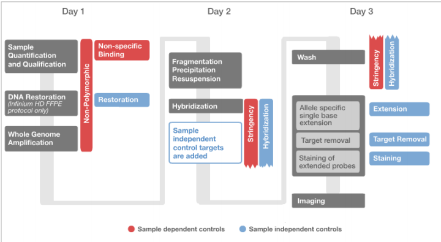

The **Sample-independent controls** are used to evaluate chip performance and are informative of efficiency of hybridization and staining. Sampleindependent controls cannot be used to assess sample quality or to identify issues with sample processing. Even if highly degraded DNA was hybridized to a chip, sample-independent controls are expected to appear normal, given that all steps preceding hybridization were performed according to protocol. This is because DNA targets for sample-independent control probes do not originate from the sample DNA. Target Removal Controls and Hybridization Controls probe targets are spiked into the hybridization buffer. The sample-independent controls include Staining Controls, Extension Controls, Target Removal Controls, and Hybridization Controls. The Restoration Control can also be categorized as sample-independent, since it does not depend on sample quality. However, the Restoration Control is only meaningful when samples were processed with the FFPE Restore kit prior to the Infinium assay.

The **sample-dependent controls** are used to evaluate assay performance across samples, and assess sample DNA quality. With the exception of Non-Specific Binding Controls, sample-dependent controls are specific to human DNA targets and cannot be used for interpretation of data obtained with non-human Infinium products, including non-human iSelect chips. In addition to poor sample quality, failure of any step in the assay (amplification, hybridization, X-stain) will result in depressed sample-dependent controls. Sample-dependent controls include Stringency Controls, Non-Specific Binding Controls, and Non-Polymorphic Controls. 

### Staining Controls (Sample-Independent) 

The Staining Controls assess the efficiency of the staining process during the X-Stain protocol. Staining controls consist of beads covered with high levels or small (background) levels of dinitrophenyl (DNP) or biotin, and are directly labeled in successive rounds of adding green fluorescent streptavidin and red fluorescent anti-DNP antibody. Because DNP and biotin are directly attached to the beads, staining controls do not depend on DNA hybridization to the chip and do not require single-base extension. Staining Controls are monitored in both the red and green channels. 

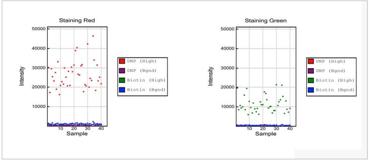

1. Staining Red:
    + Strong positive signals are expected for the dinitrophenyl (DNP) (High) data points, while background is expected for the DNP (Bgnd), Biotin (High), and Biotin (Bgnd) signals. 
2. Staining Green:
    + Strong positive signals are expected for the Biotin (High) data points, while background is expected for the DNP (High), DNP (Bgnd), and Biotin (Bgnd) data points.
    
**NOTE:** No comparison is made between the levels of positive signal between the red and green channels, nor is there a specific threshold value for the intensities. 

### Extension Controls (Sample-Independent)

The Extension Controls test the efficiency of single base extension during the X-stain protocol.  Extension Controls consist of hairpin oligos that function as both template and probe. During X-stain, probes are extended at the 3’ end using the probe strand itself as a template. Accordingly, extension controls are independent of DNA hybridization, but require successful single base extension and staining. Both red (extension with A or T) and green (extension with C or G) channels are monitored.

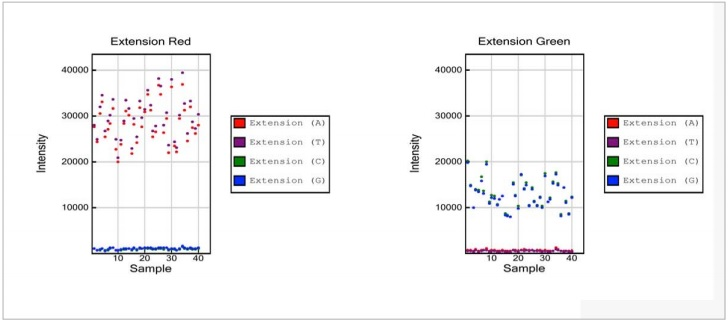

1. Extension Red:
    + Strong positive signals are expected for Extension (A) and Extension (T) data points, while signals for Extension (C) and Extension (G) are expected to be at background levels.
2. Extension Green:
    + Strong positive signals are expected for Extension (C) and Extension (G) data points, while signals for Extension (A) and Extension (T) are expected to be at background levels. 

**NOTE:** No comparison is made between the levels of positive signal between the red and green channels, nor is there a specific threshold value for the intensities.

### Target Removal Controls (Sample-Independent)

The Target Removal Controls test the efficiency of stripping off DNA templates after the extension reaction. The probe sequences are designed such that extension from the probe does not occur. Instead, the control target DNA, added with the hybridization buffer, is extended and labeled using the probe sequence as templates. Target Removal controls should yield signal intensities at background levels. Failure to efficiently remove target DNA will result in an increase in signal intensities over background levels. Target Removal Controls are monitored in the red channel. 

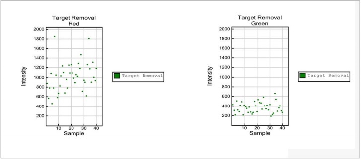

1. Target Removal Red:
    + Target removal controls are monitored in the red channel. Levels significantly above background in the red channel indicate inefficient target removal.
2. Target Removal Green:
    + Signal intensity in the green channel is expected to be at background levels

**NOTE:** No maximum threshold value is specified. Please note the difference in scale of the Y axis relative to panels for the Staining Controls and the Extension Controls. Compared to positive signals from the Staining and Extension Controls, data points for the Target Removal Control are expected to be at background levels. 

### Hybridization Controls (Sample-Independent)

The Hybridization Controls assess efficiency of DNA hybridization using synthetic targets instead of amplified DNA. These synthetic targets bind to complement probes on the array, and provide templates for single base extension. The synthetic targets are present in the hybridization buffer at three levels, monitoring the response from high-concentration (5 pM), medium concentration (1 pM), and low-concentration (0.2 pM) targets. Hybridization Controls appear in the green channel as signals with various intensities, corresponding to the concentrations at which targets are spiked into the assay. Hybridization Controls require optimal stringency conditions during hybridization and washing of BeadChips, and they depend on successful single base extension and staining. 

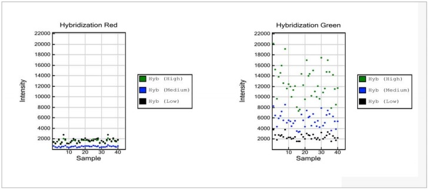

1. Hybridization Red
    + The Hybridization Controls are monitored in the green channel.Therefore, signal intensities in the red channel are expected to be at background levels.
2. Hybridization Green 
    + Data points at three different intensity levels are expected, at low (black), medium (blue) and high (green) intensities. 

**NOTE:**While no threshold values for intensities are specified, a distinct separation of signals by low, medium, and high DNA concentrations within a sample is expected. 


### Restoration Control (Sample-Independent)

The Restoration Control is used to assess the efficiency of DNA restoration in the Infinium HD FFPE protocol. The Restoration Control does not depend on the quality of sample DNA. It should show no activity for samples that have not been processed with the FFPE Restore kit. The Restoration Control uses a short oligo that has been spiked into the Infinium HD FFPE restore kit. Due to the chemistry of the Infinium HD FFPE Restore Kit, the control oligo will be available to bind to its complement on the BeadChip only if the restore process functions properly. Detection of reduced intensity of the Restoration Control may indicate that the DNA restoration process has been compromised. This control is detected in the green channel. 

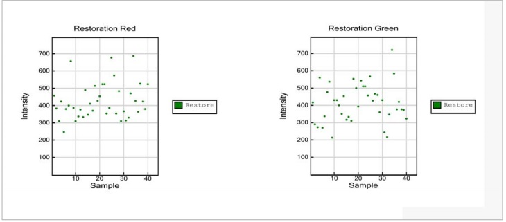

1. Restoration Red:
    + The restoration control is monitored in the green channel. Therefore, signal intensities in the red channel are expected to be at background levels.
2. Restoration Green:
    + Strong signal intensity is only expected if samples were treated with Illumina’s Infinium HD FFPE Restore Kit. Otherwise, data points are expected to be at background levels.

### Stringency Controls (Sample-Dependent)

Perfect Match (PM) and Mis-Match (MM) Stringency Controls assess the stringency of the hybridization process.  High stringency is achieved through increased temperature and optimized composition of the hybridization buffer. Perfect match (PM) controls are exactly complementary to their human DNA target, resulting in high signal intensities. In contrast, mismatch (MM) controls probes have mismatched nucleotides between target and probe to affect hybrid stability, and are expected to yield signals of much lower intensity under optimal stringency conditions. Performance of Stringency Controls is monitored in the red channel.

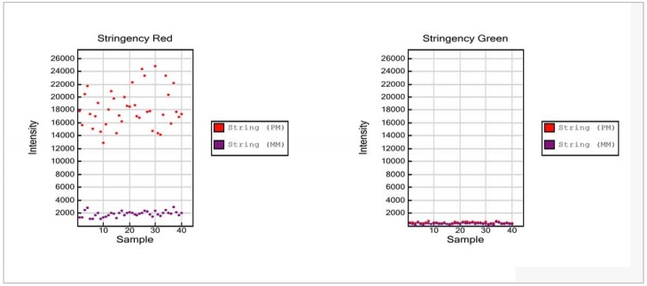

1. Stringency Red:
    + Strong positive signals are expected for String (PM) data points, while String (MM) data points are expected to be at low levels approaching background levels.
2. Stringency Green:
    + The stringency controls are monitored in the red channel. Accordingly, signal intensities in the green channel for String (PM) and String (MM) data points are expected to be at background levels.


**NOTE:** No threshold value for intensities is specified. Stringency controls target human DNA; hence, signals at background levels are expected when running a non-human Infinium assay. 

### Non-Specific Binding Controls (Sample-Dependent)

The Non-Specific Binding Controls test sample quality and specificity of the assay. Non-Specific Binding Controls are included to monitor the specificity with which amplified DNA hybridizes to the chip, assess sample DNA quality, and identify presence of non-human DNA. The probe sequences for Non-specific Binding Controls are complementary to bacterial sequences and should not hybridize to human sequences under standard hybridization conditions. Loss of the specificity of the assay and binding of non-human sequences complementary to control probes are expected to lead to increased signal intensities. These controls are monitored in both, the green and red channel, and should show intensities at background levels in both.

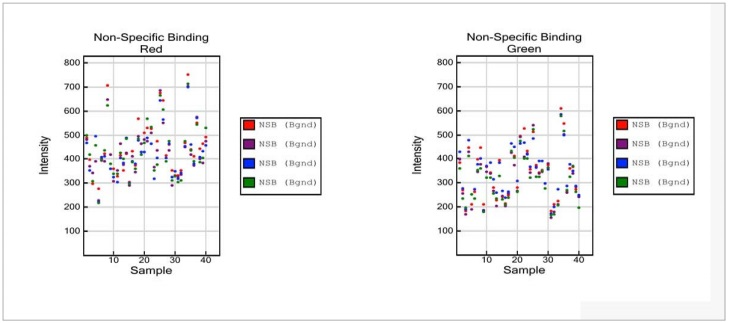

1. Non-Specific Binding Red:
    + The probe sequences for Non-specific Binding Controls are complementary to bacterial sequences, and signal intensities at background are expected under standard hybridization conditions.
2. Non-Specific Binding Green:
    + The probe sequences for Non-specific Binding Controls are complementary to bacterial sequences, and signal intensities at background are expected under standard hybridization conditions. 

**NOTE:**No maximum threshold value is specified. Please note the difference in scale of the Y axis relative to panels of Stringency Controls and Non-Polymorphic Controls. Compared to positive signals from Stringency and Non-Polymorphic Controls, data points for the Non-Specific Binding Controls are expected to be at background levels. 

### Non-Polymorphic Controls (Sample-Dependent

The Non-Polymorphic Controls assess sample quality and the overall performance of the assay by querying non-polymorphic regions of the human genome. Non-Polymorphic Controls test the overall performance of the assay, from amplification to detection, by querying a particular base in a nonpolymorphic region of the human genome. Non-polymorphic Controls are used to compare assay performance across different samples. One non-polymorphic control has been designed for each of the four nucleotides. A and T are monitored in the red channel, and C and G in the green channel.

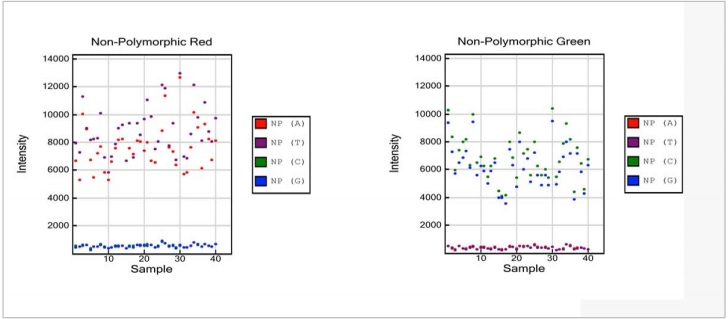

1. Non-Polymorphic Red:
    + Strong positive signals are expected for the red NP (A) and purple NP (T) data points, while the green NP (C) and blue NP (G) signals are expected to be at background levels.
2. Non-Polymorphic Green:
    + Strong positive signals are expected for the green NP (C) and blue NP (G) data points, while the red NP (A) and purple NP (T) signals are expected to be at background levels. 
    
**NOTE:**No comparison is made between intensities of positive signals between the red and green channels and A/T and C/G, nor is there a specific threshold value for the intensities. NonPolymorphic controls target human DNA; hence, signals at background levels are expected when running a non-human Infinium assay. 

## Exclude poor performing samples

This step will remove poor clustering samples that deviate from the remaining samples. These samples interfere with the clustering algorithm and are usually samples with DNA quality. It is not unusual to remove upto 10% of initial samples. Once these samples are removed, we can recluster the data using good quality samples, which will create cleaner tighter clusters and ultimately increase the call rate for the remaining samples.

1. First look for any obvious batch effects or outlying samples:
    + From the Samples Table, create a Scatter Plot of Index vs. p10GC and look for batches of outlier samples (samples with p10GC <0.4). 
2. Samples are then removed based on the clustering algorithm p10GC score:
    + Select Analysis > Exclude samples by best run > Use GC10 > Use sample ID
3. Samples with a low call rate are then removed:
    + From the Samples Table, arrange by “Call Rate”, highlight all samples with a call Rate of <0.90, right click and “Exclude Selected Samples”. 
4. Re-cluster all the SNPs using the remaining samples and re-calculate Sample & SNP statistics:
    + From the SNP Table, select all > right click on SNPs and "Cluster Selected SNPs". When prompted, click "yes" to update SNP statistics for the selected SNPs
5. (Optional) If users are removing a lot of samples, users can first exclude all samples whose call rate is <99%, and then re-cluster with all samples with a call rate >99%. The resulting clusters should be cleaner, albeit at the cost of extra work time. Excluded samples can now be reintroduced back into the project.

## Assign gender-specific colours

Throughout the QC process, samples coloured based on gender can be used for QC purposes and to identify sex-specific effects. The same concept can be applied to differentiate samples based on any other phenotype that maybe useful for QC or for discovery, such as sample source, batch, ethnicity, case-control, etc…

1. From the Samples Table:
    + Arrange by "Sex" column and highlight all "Female" samples.
    + Right click on these samples > Mark Selected Rows > Add New > write "Female" and change colour to "greenYellow" > select OK. This will highlight female samples in the "SNP Graph "as green
2. If there are a number of samples with unknown genders, this process can be repeated to highlight male and unknown samples as a different colour.

## Assign two cluster expectation to Y and MT chromosomes

By default, GenomeStudio expects three clusters per SNP, however, for the Y and MT chromosomes, we expect to find only two clusters.

1. From the “SNP Table”, use the "filter rows" button to select only Y and MT chromosome SNPs
2. Right click the selected SNPs to launch the context menu
3. Select "SNP Properties"
4. Set "ExpectedNumberOfClusters" to 2. This will re-cluster the Y and MT SNP's and set the algorithm to expect 2 clusters rather than 3

## Y Chromosome

Females do not have a Y chromosome, and therefore should not be included in the Y chromosome clusters. GenomeStudio is unable to exclude female samples from the Y chromosome SNPs and are inadvertently clustered, leading to incorrect clusters. Female samples fail to bind the Y chromosome probe and generally lie at the bottom of the SNP graph. These samples need to be manually removed. To speed up the process users can:

1. From the "SNP Table":
    + select "Clear filter"
2. re-cluster Y chromomsome SNPs using male samples only:
    + From the "Samples Table", arrange by "Gender" column, and highlight all "Female" samples
    + Right click on these samples and "Exclude Selected Samples". 
    + When prompted "Do you wish to update SNP statistics for all SNPs", select "No". 
    + Next, from the "SNP Table", use the "filter rows" button to select only Y chromosome SNPs. 
    + Then use the "select all" button to highlight all Y-chromosome SNPs, right click and select "Cluster Selected SNPs". If prompted, do not update statistics. 
    + Now select the female samples that were removed from the "Samples Table" and reintroduce them by right clicking and selecting "Include Selected Sample".  When prompted, "Do you wish to update SNP statistics for all SNPs", select "No". 
    + From the "SNP Table", "select all" Y-chromosome SNPs, right click and "Update Selected SNP Statistics".

3.   Female samples are expected not to bind the Y chromosome probe and as a result will exhibit a low binding intensity, which is represented in the "SNP Graph" with a low NormR intensity (~<0.2). However, due to the repetitiveness nature of the Y chromosome and the fact probe sequences are only 50bp, probes targeting the Y chromosome may bind a different region of the genome, resulting in unusually high NormR intensity (~>0.2). Use the following criteria to manually re-cluster or zero an unreliable Y chromosome SNP:
    + Female samples should be excluded from all clusters
    + Female samples should have a NormR intensity < 0.2 
    + No samples should be assigned to the AB Cluster
    + Arrange by descending call frequency by selecting call frequency column followed by the sort column (descending) tab 
    
**Examples of how to cluster Y chromosome SNPs are shown below**

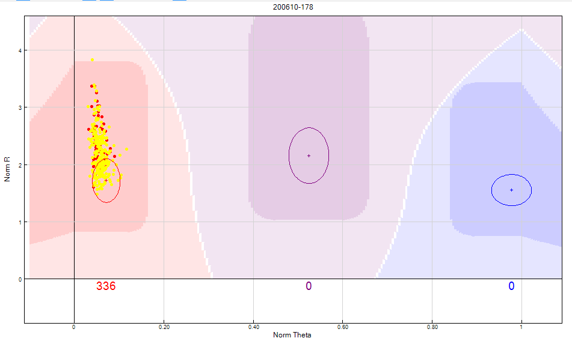

<br>


```{r, echo=FALSE,out.width="49%", out.height="20%",fig.cap="Figure 11: The GenomeStudio clustering algorithm fails to take into consideration that a female sample should not be clustered on Y chromosome SNP’s. In this scenario, the female samples are highlighted in yellow. Clusters are bunched together causing the clustering algorithm to fail and consequently giving the SNP a no call. The heterozygote cluster needs to be manually edited to exclude female samples as shown above.",fig.show='hold',fig.align='center'}

knitr::include_graphics(c("GenomeStudio_user_guide/fig 2a.png","GenomeStudio_user_guide/fig 2b.png"))
``` 

<br>

```{r, echo=FALSE,out.width="49%", out.height="20%",fig.cap="Figure 12: Female samples represented by the yellow dots should not have Y chromosome SNP’s. The female samples should be manually excluded from the heterozygote cluster as shown above.",fig.show='hold',fig.align='center'}

knitr::include_graphics(c("GenomeStudio_user_guide/3a.png","GenomeStudio_user_guide/3b.png"))
``` 


## X Chromosome

Males have a single X chromosome, therefore, X SNPs should have no male subjects in the heterozygote cluster (AB). Due to the high number of X chromosome SNPs, its time-effective to remove male samples from the project and re-cluster the X-chromosome SNPs based only on female samples:

1. From the "SNP Table":
    + select "Clear filter"
2. From the “Samples Table”:
    + Arrange by "Gender" column and highlight all "Male" samples. 
    + Right click on these samples and "Exclude Selected Samples". When prompted "Do you wish to update SNP statistics for all SNPs", select "No".  
3. From the “SNP Table”:
    + Use the "filter rows" button to select only X chromosome SNPs. 
    + Use the "select all" button to highlight all X-chromosome SNPs
    + Right click and select "Cluster Selected SNPs". If prompted, do not update statistics.
4. From the “Samples Table”:
    + Select the male samples that were removed and reintroduce them by right clicking and selecting "Include Selected Sample".  When prompted, "Do you wish to update SNP statistics for all SNPs", select "No". 
5. From the SNP Table:
    + "select all" X-chromosome SNPs, right click and "Update Selected SNP Statistics".
    + Use the "filter rows" button to select "Chr=X"
    + Arrange SNPs by descending AB Frequency by selecting the "AB Freq" column followed by the "sort column (descending)" tab. 
    + Review these SNPs and ensure no Male sample is assigned to in the heterozygote (AB) cluster


## MT Chromosome

The MT chromosome is maternally inherited, and should not show any heterozygote clusters.

1.	From the "SNP Table":
    + Select "Clear filter"
    + Use the "filter rows" button to select only MT chromosome SNPs and arrange by descending AB Frequency by selecting the "AB Freq" column followed by the "sort column (descending)" tab. Manually review all SNPs, ensuring there are no heterozygote clusters
    
## XY Chromosome

The XY SNP's are are known as the Pseudoautosomal (PAR) SNPs and are present on both X and Y chromosomes.

1. From the "SNP Table":
    + Select "Clear filter"
    + Use the "filter rows" button to select only XY chromosome SNPs. These are PAR SNPs may show male heterozygotes. The XY chromosome should be treated as an autosomal chromosome.
    
## Autosomal Chromosomes


The following steps will identify potential problematic SNPs which need to be manually reviewed and if necessary, edited or removed. As the X, Y and MT chromosomes have already been reviewed, these SNP’s should be excluded from all following filters. Ensure you include the XY chromosome in the autosomal chromosome. The following filters are all applied from the “SNP Table” window by slecting the "Filter Table Rows" tab. Some filters need to be selected from the "Sub Columns" window which can be activated by selecting the chip name in the "Columns" window

1.	Exclude the X Y and MT chromosomes (apply this to all the following filters):
    +	From the SNP Table, use the "filter rows" button to select "Chr != X" and "Chr != Y" and "Chr != MT" 
2.	Review all SNPs that have failed to cluster:
    +	Filter only SNPs with a call rate of zero and manually re-cluster if possible. 
3.	Identify low intensity SNPs (see figure 13):
    +	From Columns select "AB Freq != 0" and the chip name to activate the "sub columns" window. Then from "sub columns" window select "AB R mean" < 0.2
    +	From Columns select "AA Freq != 0" and the chip name to activate the "sub columns" window. Then from "sub columns" window select "AA R mean" < 0.2
    +	From Columns select "BB Freq != 0" and the chip name to activate the "sub columns" window. Then from "sub columns" window select "BB R mean" < 0.2 

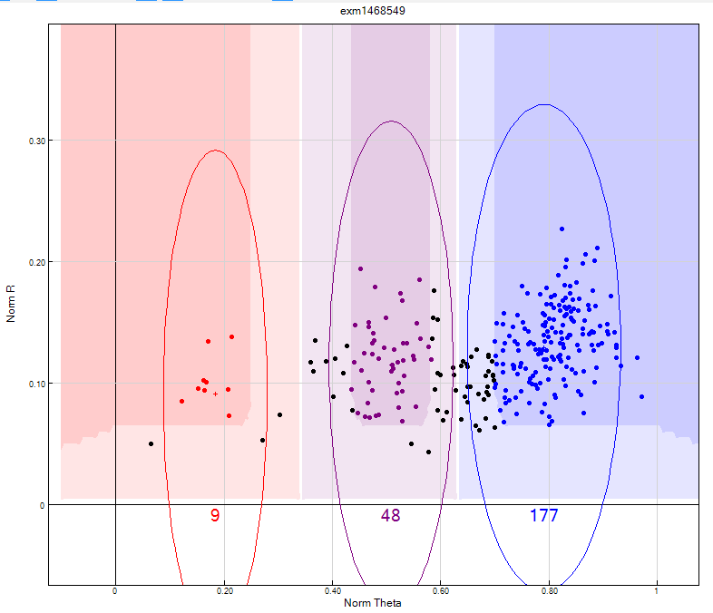

4. Identify clusters that are very close. These maybe fused/over-lapping clusters that can be clearly separated. If they cannot be separated then these SNPs should be zeroed (see figure 14):
    + Cluster Sep < 0.35"
    + Arrange the data by selecting the sort by descending "Cluster sep" column 

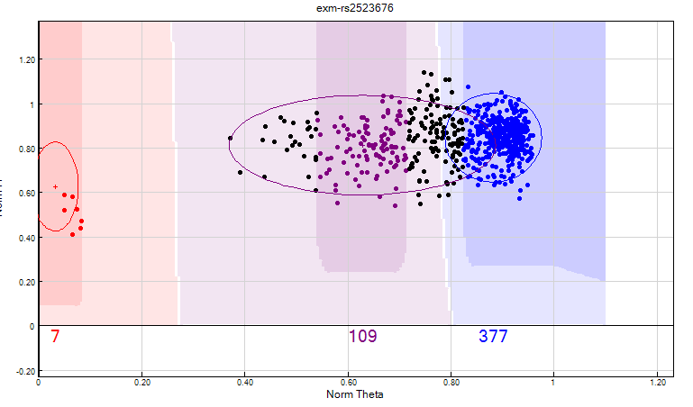


5. Identify SNP’s with unusually levels of samples in heterozygote (AB) cluster:
    + AB frequency > 0.6 (based on AB count)
    + AB frequency = 0 and minor allele frequency > 0 
    + AA frequency = 1 and Call Freq < 1 (Identify missed AB calls. If the number of SNPs to review are high, then call Freq can be reduced, e.g Call Freq = 0.98)
    + BB frequency = 1 and Call Freq < 1 (Identify missed AB calls. If the number of SNPs to review are high, then call Freq can be reduced, e.g Call Freq = 0.98)
    + Het excess > 0.3 (based on Hardy-Weinberg Equilibrium, see figure 15)
    + Het excess < -0.3  (will identify deficient heterozygote calls relative to expected based on Hardy-Weinberg Equilibrium, see figure 16)
    
    


6. Identify SNP's where their clusters are outside their expected position:
    + AA theta mean > 0.3 and AA Freq !=0
    + BB theta mean < 0.7 and BB Freq !=0
    + AB theta mean < 0.3 and AB Freq !=0
    + AB theta mean > 0.7 and AB Freq !=0
7. Identify unusually large clusters (see figure 17):
    + AA theta deviation > 0.025
    + AB theta deviation ≥ 0.07
    + BB theta deviation > 0.025
    
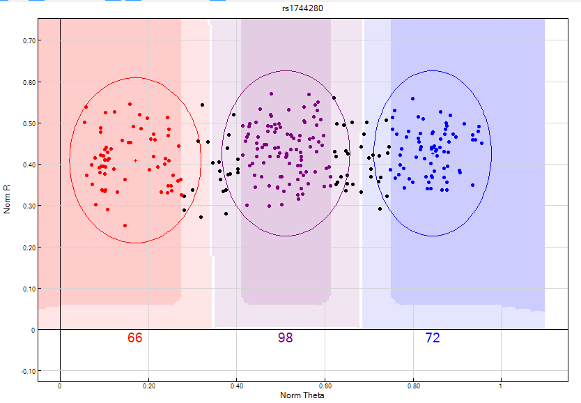 

8. Identify SNPs where the Genomestudio algorithm has low confidence in clustering:
    + SNPs with GenTrain scores of <0.7 Edited !=1 

## Chromosome 0

During manifest creation, the probe sequence is mapped to the genome build notated in the GenomeBuild column in the manifest. The SNP or indel coordinate is then recorded in the MapInfo column. If a marker is annotated with Chr = 0 or MapInfo = 0 in the manifest, there are two possible explanations:

1. No valid mapping for the probe.
2. More than 1 best-scoring mapping for the probe.

How do I find out why a probe is mapped to Chr 0?

For loci assigned a zero for Chr/MapInfo in the manifest, refer to the Mapping Comments file found in the product support files at Illumina.com. This file provides the reason for the notation:

    + Blank – There were no complications in mapping the location of the variant.
    + No probe mappings – The Chr and MapInfo fields in the manifest have been set to 0, as no valid alignments were identified for the probe sequence in the updated genome build.
    + Multiple mappings – The Chr and MapInfo fields in the manifest have been set to 0, as multiple best scoring alignments were identified for the probe sequence. The locations of the multiple mappings are supplied as a semi-colon delimited list.

During QC, chromosome 0 SNPs are treated as autosomal and are included in the autosomal SNP QC process.

# GENDER ESTIMATION

GenomeStudio uses the X chromosome to estimate the gender of samples. Therefore, the X chromosome must under go QC prior to estimating gender. To estimate the gender:

1. From the "SNP Table":
    + Select "Clear filter"
    + select all SNPs, right click and “Update Selected SNP Statistics”
2. From the “Samples Table”:
    + right click and “Recalculate Statistics for all Samples”
    + select all samples, right click and select "Estimate Gender for selected samples". When prompted "populate Gender column", select "No".
    + Select the Column Chooser icon and show “Gender Est” from Hidden Columns.

# UPDATE STATISTICS

Following QC, statistics for samples and SNP's need to be updated by:

1. In the "SNP Table":
    + click "Select all"
    + right click on the highlighted SNPs
    + click “Update Selected SNP Statistics”
2. In the "Samples Table":
  + click "Select all" 
  + right click on the highlighted samples
  + click “Recalculate Statistics for all Samples”


# SAVE PROJECT 

To save the current changes:

1. click on "File":
    + "Save Project Copy As":
    + Navigate to the "06.GenomeStudio_project" folder
    + save as: [PROJECT_NAME]_[DATE]_02.bsc


# CREATE INPUT FOR COPING

COPING is a containerised workflow for processing Illumina genotyping data. The container is deployable on multiple platforms and allows users to quickly and effortlessly prepare, pre-process and understand Illumina microarray SNP data for data analysis through an informative and interactive summary report.The output data will be converted to PLINK format for the user to perform addtional analysis.


To create the input file:

1. Remove all filters to display all remaining SNPs and Samples
2. Select Full Data Table
3. Select Column Chooser
4. From the Displayed Columns window select:
    + Index
    + Address
    + Gen Train Score
    + Frac A
    + Frac C
    + Frac G
    + Frac T
5. Click Hide
6. From the Displayed Subcolumns Window select:
    + Score
    + Theta
    + R
7. Click Hide
8. From the Hidden Subcolumns Window select:
    + X
    + Y
9. Click Show
10. Ensure the columns are in the order shown below:

 

11. Select all SNPs
12. Select Export displayed data to file.
13. Browse to the “07.GenomeStudio_final_reports” folder and save as [PROJECT_NAME]_[DATE]_intensity_data.report in tab delimited format

# CNV (STILL UNDER DEVELOPMENT)

## Introduction and courses

Copy Number Variation (CNV) is when the number of copies of a particular gene varies from one individual to the next. CNV's can be calculated within GenomeStudio or using external softwares.Here are some useful links for using GenomeStudio:

1. [Illumina CNV Basics course](https://support.illumina.com/content/dam/illumina-support/courses/CNV_Analysis/story_html5.html)
2. [GenomeStudio: Performing CNV Analysis using cnvPartition](https://support.illumina.com/content/dam/illumina-support/courses/GenomeStudio-cnvPartition/story_html5.html)
3. [Illumina Assay: CNV Analysis using GenomeStudio](https://www.youtube.com/embed/L_8eCfcT6_E?autoplay=1&rel=0)
4. [DNA Copy Number and Loss of Heterozygosity Analysis Algorithms](https://www.illumina.com/documents/products/technotes/technote_cnv_algorithms.pdf)
5. [Interpreting Infinium® Assay Data for Whole-Genome Structural Variation](https://www.illumina.com/Documents/products/technotes/technote_cytoanalysis.pdf)
6. [CNV Technical Standards Web Series](https://clinicalgenome.org/tools/cnv-webinar/)

**NOTE: Illumina recommends using high-density chips such as the omni family. Low density chips are not recommended**

## GenomeStudio Basics

1. Loss of Heterozygosity (LOH):
    + A region that no longer as two different alleles
2. Gain of Heterozygosity (GOH):
    + A region that gains an addtional allele
1. B Allele Frequency (BAF):
    + How often a B allele is called
    + Deviation from an average 0.5 can indicate CNV
2. Log R Ratio (LRR):
    + normalised signal intensity. For each SNP, expected call regions are calculated based on previous data. Each call region has an expected R (equal to the sum of normalised red and green signal intensity and theta value for a given cluster).
    +LRR = log2(R obs/R exp)
3. Log R Ratio calculations need to be taken into account to confirm CNV, especially in the case of LOH

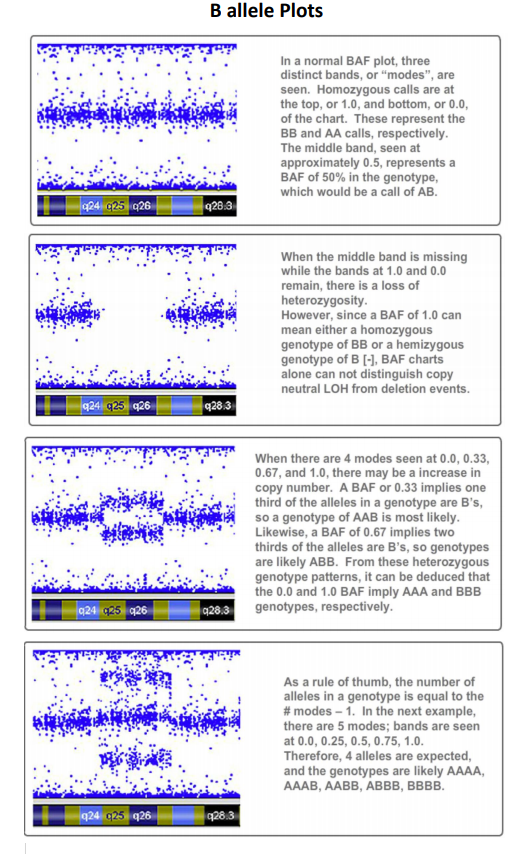
<br>
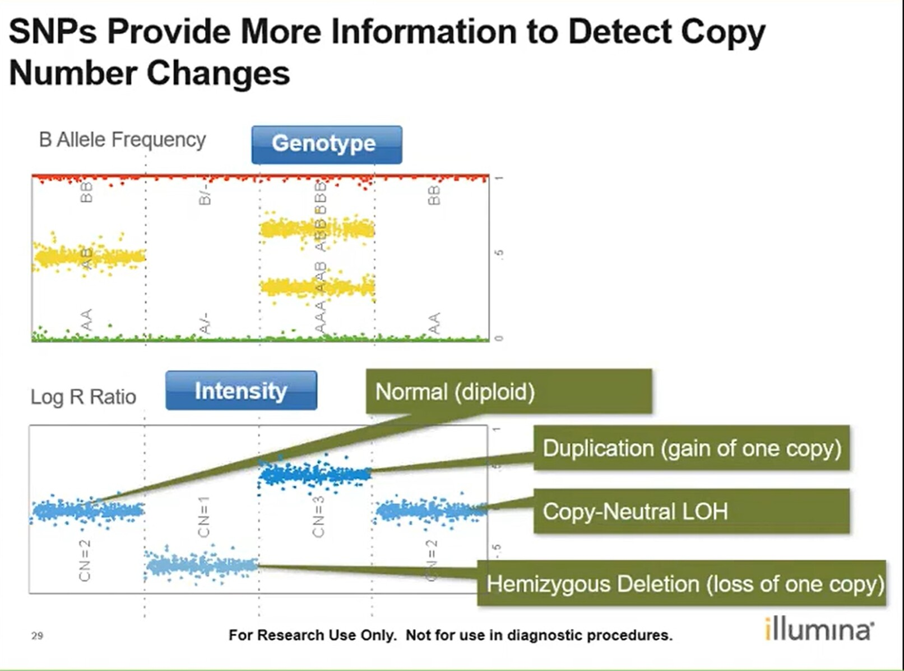


4. Mosaicism is when a person has 2 or more genetically different sets of cells in their body. This can be identified through the B allele frequency plot + Log R Ratio:


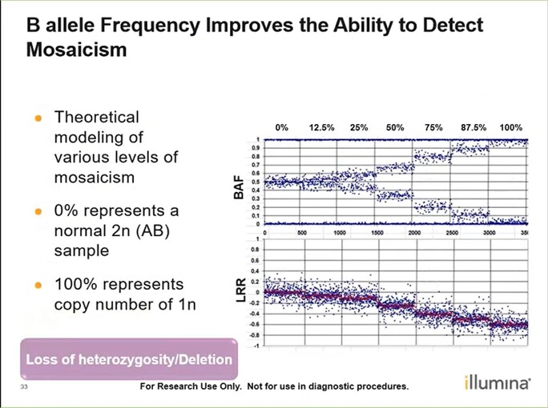
<br>
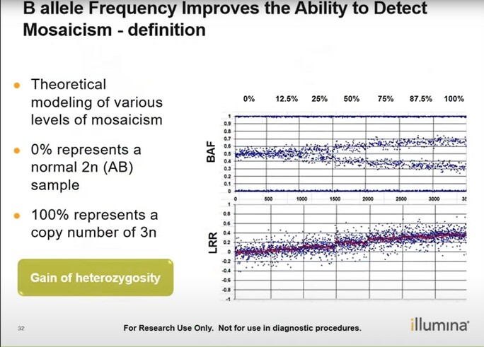


## GenomeStudio - CNVpartition

To calculate CNV in GeneomStudio, the [cnvPartition](https://emea.support.illumina.com/downloads/genomestudio-2-0-plug-ins.html) must be installed.

1. On the main window:
    + Click "CNV Analysis"
    + Click on the dropdown menu and select "cnvPartition 3.2.0"
    + click "calculate New CNV Analysis". This ca take several minutes to hours depending on sample/SNP size and comput power
    + This performs the calculations and provides a graphical output. The results can be introduced into the full table using the "add column" button and adding "CNV confidence" and "CNV value".

    
CNV              |    CNV Value     |  CNV Confidence |
-----------------|------------------|-----------------|
Normal           |        2         |       blank     |
Amplification    |        3         |        xx       |   
Deletion         |        1         |        xx       |
Copy neutral LOH |        2         |        xx       |


To view Individual chromosomes, in the main menu:
    + Click on "Tools"
    + Click on "Show Genome Viewer"
    + In the "Table-Sample-SubColumn" window, select the samples you want to view
    + In the "SubColumns"window, select "B allele Freq" and "Log R Ratio"
    + Click on "Add to favourite"
    + Click on "OK"
    + Click on the "update" tab
    + click on "View" and select "chromosome browser"
    
To view more information, within the "Illumina Genome Viewer (IGV) - Micoarray -" window:
    + click "view" -> "CNV Analysis as Bookmarks"
    + ClicK "OK"
    + you can hoover over shaded regions and it will provide you more information on the CNV
    
To export into table format, within the "Illumina Genome Viewer (IGV) - Micoarray -" window:
    + click "view" -> "Bookmark Viewer"
    + Export using the "export displayed data to file"

## GenomeStudio - CNV region report

This is based on the [CNV Region Report Plug-in v2.1.2](https://emea.support.illumina.com/downloads/genomestudio-2-0-plug-ins.html) for GenomeStudio

The Illumina GenomeStudio CNV Region Report Plug-in is a software plug-in that works with Illumina’s GenomeStudio Genotyping module. This plug-in lets you create three separate reports:

1. A Standard Report that lists each copy number variation (CNV) and loss of heterozygosity (LOH) region for each sample
2. An Allele-Specific Copy Number Report that reports copy number informed genotypes such as A- and ABB
3. A PLINK CNV Input Report, that creates input files for select CNV features of the PLINK GWAS and CNV analysis application

To generate the standard report, in the main window:
1. Select "Analysis" -> "Reports" -> "Report Wizard":
     + Select "Custom Report"
     + from the drop down menu, select "CNV Region Report"
     + under the "Report Input Paramter", click on "CNV Analysis File" and select the .bin file generated in [CNVpartition].
     + Continue to click "Next", leaving all settings as default.
     + Select the output path where you want to generate the report and name the report.
     + Click "Finish"


## Create input for PennCNV

This will create an input file for the [PennCNV](http://penncnv.openbioinformatics.org/en/latest/) analysis tool

1. Select Full Data Table
2. Select Column Chooser
3. From the Displayed Subcolumns window select:
    + X
    + Y
4. Click Hide
5. From the Hidden Subcolumns window select:
    + Log R Ratio
    + B Allele Freq
6. Click Show
7. Ensure columns are in the order as shown below:

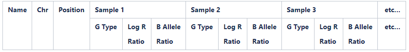
8. Select all SNPs
9. Select Export displayed data to file
10. Browse to the“07.GenomeStudio_final_reports” folder and save as [PROJECT_NAME]_[DATE]_PennCNV_input.txt in tab delimited format


[PennCNV: Quick start-up guide with examples](https://www.openbioinformatics.org/penncnv/penncnv_examples.html)

## iPsychCNV

[iPsychCNV](https://biopsyk.dk/ipsychcnv/) is an R package software capable of finding copy number variation in amplified DNA from dried blood spots on Illumina SNP array. It can handle large variation on Log R ratio, and use B allele frequency to improve CNV calls. 

## CNVRuler

The method for genome-wide association study (GWAS) based on copy number variation (CNV) is not as well established as that for single nucleotide polymorphism (SNP)–GWAS. Although there are several tools for CNV association studies, most of them do not provide appropriate definitions of CNV regions (CNVRs), which are essential for CNV-association studies. Outputs from the 10 most common CNV defining algorithms can be directly used as input files for determining the three different definitions of CNVRs. Once CNVRs are defined, [CNVRuler](https://academic.oup.com/bioinformatics/article/28/13/1790/234696) supports four kinds of statistical association tests and options for population stratification. CNVRuler is based on the open-source programs R and Java from Sun Microsystems.

## EnsembleCNV

The associations between diseases/traits and copy number variants (CNVs) have not been systematically investigated in genome-wide association studies (GWASs), primarily due to a lack of robust and accurate tools for CNV genotyping. [ensembleCNV](https://academic.oup.com/nar/article/47/7/e39/5306576) can detect and genotype CNVs using single nucleotide polymorphism (SNP) array data. EnsembleCNV (a) identifies and eliminates batch effects at raw data level; (b) assembles individual CNV calls into CNV regions (CNVRs) from multiple existing callers with complementary strengths by a heuristic algorithm; (c) re-genotypes each CNVR with local likelihood model adjusted by global information across multiple CNVRs; (d) refines CNVR boundaries by local correlation structure in copy number intensities; (e) provides direct CNV genotyping accompanied with confidence score, directly accessible for downstream quality control and association analysis. Benchmarked on two large datasets, ensembleCNV outperformed competing methods and achieved a high call rate (93.3%) and reproducibility (98.6%), while concurrently achieving high sensitivity by capturing 85% of common CNVs documented in the 1000 Genomes Project. Given this CNV call rate and accuracy, which are comparable to SNP genotyping, we suggest ensembleCNV holds significant promise for performing genome-wide CNV association studies and investigating how CNVs predispose to human diseases.

# REFERENCE

If using this document in your research, then please reference the COPING paper:


